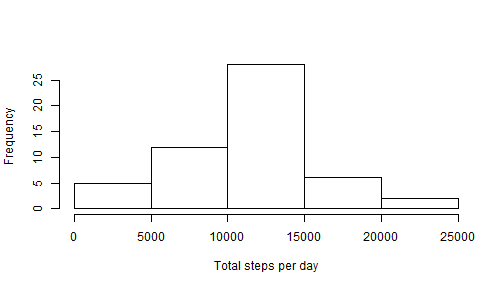
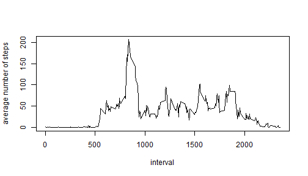
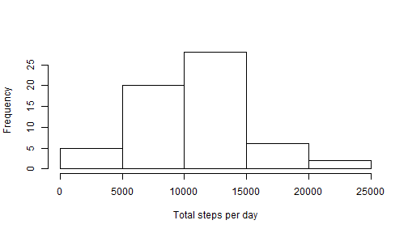
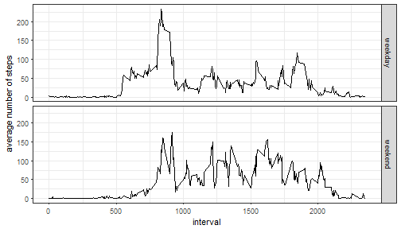

# Coursera Reproducible Research - Project 1
Tom Marty

### Loading and preprocessing the data
First, we will read in the data and quickly check that it's tidy.


```r
library(data.table)
unzip('./activity.zip')
actvyDat <- fread('activity.csv', sep=",",header = TRUE)
str(actvyDat)
```

```
## Classes 'data.table' and 'data.frame':	17568 obs. of  3 variables:
##  $ steps   : int  NA NA NA NA NA NA NA NA NA NA ...
##  $ date    : chr  "2012-10-01" "2012-10-01" "2012-10-01" "2012-10-01" ...
##  $ interval: int  0 5 10 15 20 25 30 35 40 45 ...
##  - attr(*, ".internal.selfref")=<externalptr>
```
We can see data is in an appropriate, tidy format and ready for analysis.

### What is mean total number of steps taken per day?
Let's calculate the total number of steps taken for each different day in our 
dataset and visualise the result using a histogram. We will also take a look at
 the mean and median steps taken per day.

```r
perDay <- aggregate(steps ~ date, actvyDat, sum, na.rm=TRUE)
hist(perDay$steps, xlab = "Total steps per day",main = NULL)
```



```r
round(mean(perDay$steps),0)
```

```
## [1] 10766
```

```r
median(perDay$steps)
```

```
## [1] 10765
```

### What is the daily average activity pattern?
Now we will take a look at the daily activity pattern by averaging over every
day for each 5-minute interval.

```r
perInterval <- aggregate(steps~interval, data = actvyDat, mean, na.rm=TRUE)
plot(perInterval$interval, perInterval$steps, type='l', 
     ylab = "average number of steps", xlab=("interval"))
```



We can check which 5-minute interval contains the maximum number of steps, on 
average.


```r
maxInterval <- perInterval$interval[which.max(perInterval$steps)]
maxInterval
```

```
## [1] 835
```
  
### Imputing missing values
We could see from the preview of our dataset shown earlier that the 'steps' 
variable contains a bunch of missing data. So far we have ignored it but we 
better check how much is missing.

```r
totalNa <- sum(!complete.cases(actvyDat))
totalNa
```

```
## [1] 2304
```
That's quite a lot missing data. Let's replace the missing data for each 
interval with the average values we calculated earlier, and store the result in
a separate object.


```r
missingIndex <- which(is.na(actvyDat$steps))
missingIntervals <- actvyDat$interval[missingIndex]
imputedDat <- actvyDat
imputedDat$steps[missingIndex] <- 
        round(perInterval$steps[as.integer(missingIntervals/5+1)],0)
```
Now that's done, we can create another histogram and compare the mean and median 
steps taken per day for our modified dataset.


```r
imputedPerDay <- aggregate(steps ~ date, imputedDat, sum, na.rm=TRUE)
hist(imputedPerDay$steps,xlab = "Total steps per day", main = NULL)
```



```r
round(mean(imputedPerDay$steps),0)
```

```
## [1] 10282
```

```r
median(imputedPerDay$steps)
```

```
## [1] 10395
```
Firstly, we notice the histogram contains more observations. This makes sense 
since we removed the missing values when we created our aggregate. We can also 
see that both the mean and median have dropped, and the distance between them 
as increased. So our imputed data has a lower daily average and is more skewed
than when the missing data was removed.

### Are there differences in activity patterns between weekdays and weekends?
We will create a new factor variable in the dataset with two levels - "weekday" 
and "weekend" indicating whether a given date is a weekday or weekend day.

```r
dayOfWeek <- as.factor(weekdays(as.Date(actvyDat$date),abbreviate = TRUE))
actvyDat$weekend <- as.factor(dayOfWeek=="Sat"|dayOfWeek=="Sun")
levels(actvyDat$weekend) <- c("weekday","weekend")
```
Let's finish up by creating a plot with our new factor variable to visualise how
the activity patterns might between weekdays and the weekend.


```r
library(ggplot2)
dayAggregate <- aggregate(steps~interval+weekend, data=actvyDat,mean)
g <- ggplot(data=dayAggregate,aes(x=interval, y=steps)) + geom_line()
g + facet_grid(weekend~.) + ylab("average number of steps") + theme_bw()
```


